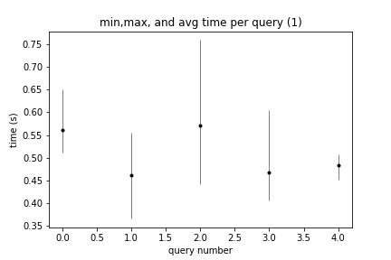
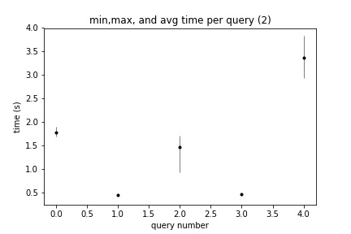
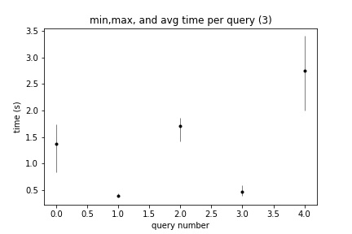
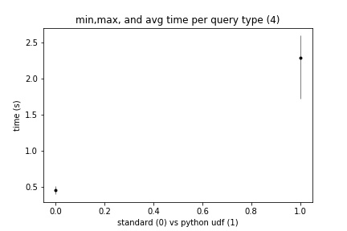
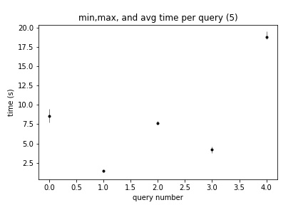

---
output:
  pdf_document: default
  html_document: default
---
# Homework 1

## General Notes
- 1) This document highlights the findings and observations of the various queries executed on the AWS redshift cluster database.
- 2) On all subsequent graphs, unless otherwise specified, x labels 0,1,2,3,4 correspond to queries 1,2,3,4,5 highlighted in question 1
- 3) All results, including exact query execution times among all trials, number of rows returned, and samples of the rows returned can be found in 'q1and4.sql' and 'q2q3q5.sql'
- 4) All queries and results were discovered using the AWS query editor provided along with redshift

## Question 1 Results:
- 2 cores
- 1 GB data

## Observations:
Query 3 and 1 showed the longest run times on average. This may be due to the multijoin handled in each. Considering  both sum and max would take roughly similar amounts of time, thats what I would expect. Meanwhile query 2 being the simplest operationally holds the shortest execution time.

## Question 2 Results:
- 2 cores
- 10 GB data

## Observations:
A similar pattern holds, except now query 4 has taken much longer to execute than what we saw previously. In general, we see a marked increase in query execution time overall. The only datapoint that follows a roughly 10 time increase in execution time (corresponding with the 10x increase in data size) is query 5. Furthermore, queries 2 and 4 sit a roughly similar execution times as there 1GB counter parts.

## Question 3 Results:
- 4 cores
- 10 GB data

## Observations:
The same pattern in run times appears with doubled cores available. However, we see decreased execution times for all queries, but most notably queries 1 and 5. About a .5 second decrease for about both processes. It appears that query 3 remains rather stagnant in its execution time. My hypothesis would be that increasing cores offers no additional computational power.

## Question 4 Results:
- 2 cores
- 1 gb data

## Observations:
Creating a python UDF showed a marked increase in computation time. I would currently argue that python is more "user friendly" for many queries, but comes at a significant cost to the run time. I also tried this with 4 cores, but saw no real improvement in the python UDF execution version.

## Question 5
- 4 Cores
- 0 data (all data kept on S3)

## Observations:
In general, we see the same pattern as question 1,2,3. However, we see that queries 2 and 4 are no longer similar in execution time. Furthermore, all queries have a much large increase in execution time reported. I am unsure of the internals of how redshift queries data that isnt stored locally, but whatever mechanism this is, it comes at a significant performance cost.

## Reflection:
Overall, increasing cores and data size saw some level of speed up, scale up being harder to gauge as we didnt expand up to 10 cores. Most notably, we saw some speedup in the execution of query 5, the most intensive of our queries, when we doubled our cores from 2 to 4 when querying our 10GB data. I am curious how redshift executes its queries on external tables on S3, as the large increase in execution time was expected, but I wonder how. I also wish that the execution details button on the query editor was working.

## Appendix
- Find all SQL queries, execution times, num rows returned, and sample output in the sql files indicated in the __General Notes__ above. The execution times, num rows, and output rows are commented underneath each query.
